# Comprehensive-Microservices-PoC
## Robot Shop
`Robot Shop` project [[GitHub Repo]](https://github.com/instana/robot-shop) was originally developed by `Instana` (now part of IBM 
[[IBM Instana Observability]](https://www.ibm.com/products/instana)) as a PoC (Proof of Concept) to demonstrate their APM (Application Performance Management) tool.
Licensed under the Apache License 2.0, this sample microservices application simulates an e-commerce platform for selling robots and AI products. Built with a variety of programming languages and frameworks, Robot Shop provides a comprehensive environment for exploring cloud-native architectures and DevOps best practices.

## Comprehensive Microservices PoC
This project is my customized adaptation of `Robot Shop`, serving as a sandbox environment to explore, experiment, and demonstrate real-world DevOps practices, cloud-native architectures, and GitOps workflows with `production-level` standards. The project showcases hands-on expertise in `infrastructure management`, `automation`, and `container orchestration`, aligning with industry best practices for resilient, scalable solutions.

## Project Implementation Strategy
This project adopts a structured, step-by-step approach to deploying and managing microservices, simulating a real-world, scalable environment. Each stage is designed to demonstrate key DevOps practices, starting with foundational setups and progressing towards advanced automation and orchestration.
- **Manual Integration & Deployment**: Each microservice is initially `deployed manually` on dedicated AWS EC2 instances to establish a foundational environment for further automation steps.
- **Shell Scripting**: Services are configured and deployed using `shell scripts` to automate repetitive setup and configuration tasks, improving deployment efficiency and consistency.
- **Configuration Management**: `Ansible` automates service deployments, enabling consistent and scalable configurations across environments.
- **Infrastructure as Code (IaC)**: `Terraform` provisions and manages infrastructure resources, ensuring reproducible and scalable infrastructure setups.
- **CI/CD Pipeline**: `Jenkins` facilitates continuous integration and delivery, supporting a streamlined workflow for updates and deployments.
- **Containerization and Orchestration**: Microservices are containerized and orchestrated with `Kubernetes`, using `Helm charts` to simplify and manage deployment configurations effectively. 

Finally, using `Argo CD` to implement `GitOps`, the setup achieves continuous deployment, synchronizing Kubernetes clusters with version-controlled configurations to maintain a scalable, reliable, and production-mimicking environment.

## System Design Overview
This project follows a 3-tier architecture, a common design for scalable, robust applications. The architecture is divided into three distinct layers.

  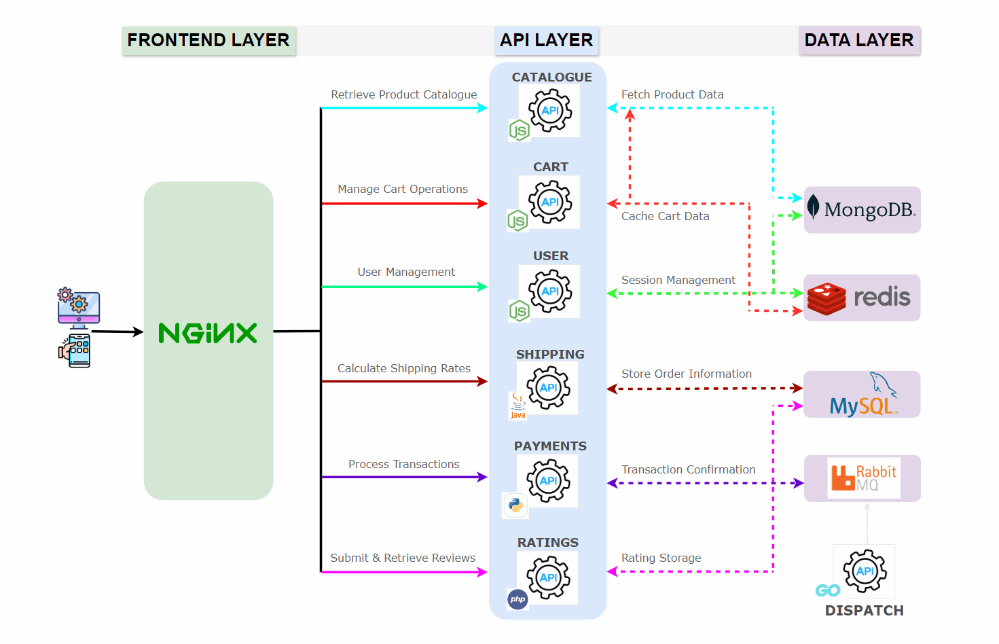
   
  <em>Fig: System design overview</em>

## 1. **Frontend Layer**:
- **Nginx**: The frontend service, using Nginx, handles incoming requests and serves the UI for the application.
- **Reverse Proxy Configuration**: Nginx is used as a reverse proxy to direct incoming traffic from the frontend to the appropriate backend services (e.g., catalogue, user). This setup enhances `load distribution`, `security`, and `scalability` by acting as an entry point for all API requests.
## 2. **API Layer**:
 The API layer consists of multiple microservices, each built with different languages demonstrating flexibility in microservices architectures. Services include,
- **User, Catalogue, and Cart** - `Node.js`
- **Payments** - `Python`
- **Shipping** - `Java`
- **Ratings** - `php`
- **Dispatch** - `Go`
 
Each service is independently deployable, allowing for flexibility and scalability based on demand.

## 3. **Data Layer**: 
The data layer includes various databases and messaging systems for handling different types of data.
- **MongoDB**: Stores product catalog data.
- **MySQL**: Likely used for relational data (e.g., Store Order Information).
- **Redis**: Acts as a caching layer, improving response times for frequently accessed data.
- **RabbitMQ**: Manages message queues for asynchronous tasks, such as notifications or order processing.

## Key Interactions:
Let’s say a user wants to view a list of products: 
- The Frontend Layer sends a request to the API layer, asking for the product catalog.
- The API Layer receives this request, processes any business logic (such as filtering or sorting), and queries the Data Layer for the product data.
- The Data Layer responds to the API layer with the requested data.
- The API Layer sends the data back to the Frontend Layer in a structured format.
- The Frontend Layer displays the product data to the user.

## Application UI Overview
Below are screenshots of the Robot Shop web interface, highlighting various microservices in action and showcasing the application's design and functionality.

### 1. Landing Page
The Robot Shop landing page should display product categories and provides user options for login or registration.

  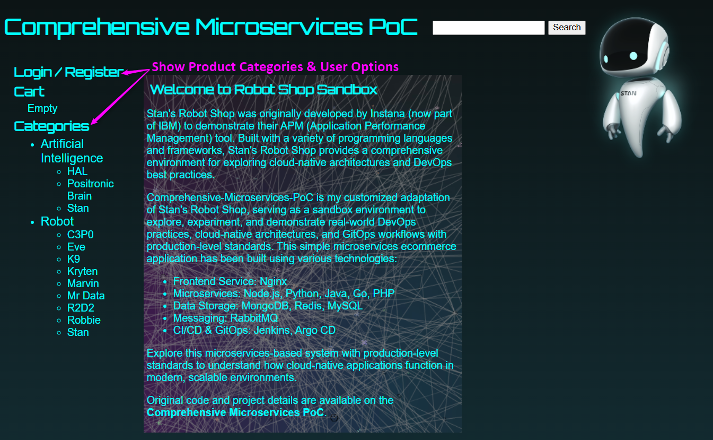
   

### 2, User Registration
Users can register with their details, and upon successful registration, their information is displayed for confirmation.

  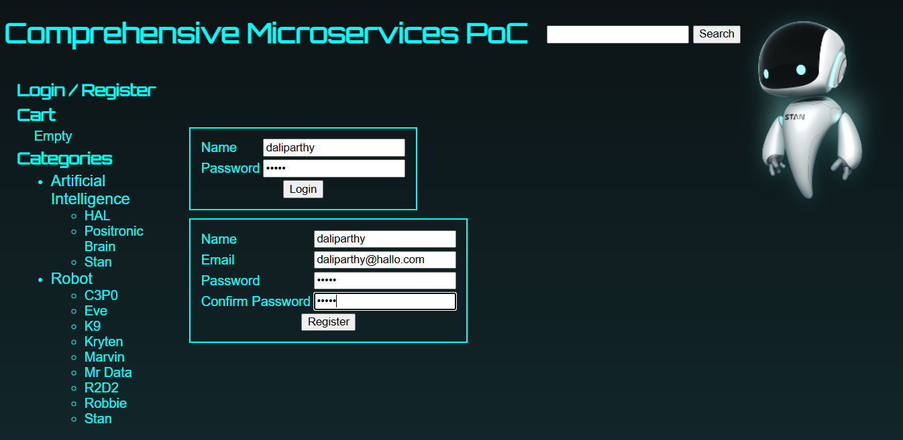
   

  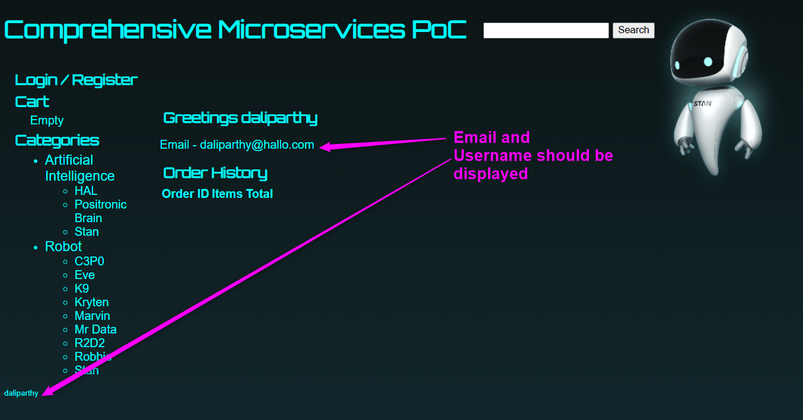
   

### 3. Product Selection and Cart
Users can browse categories, add products to their cart, and proceed to checkout for purchase.

  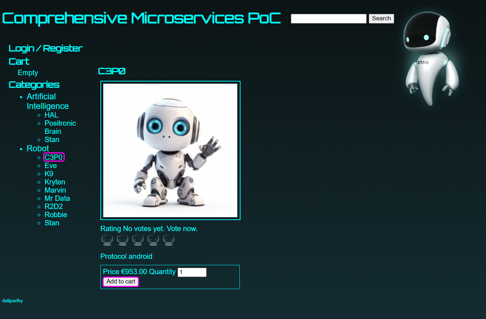
   

  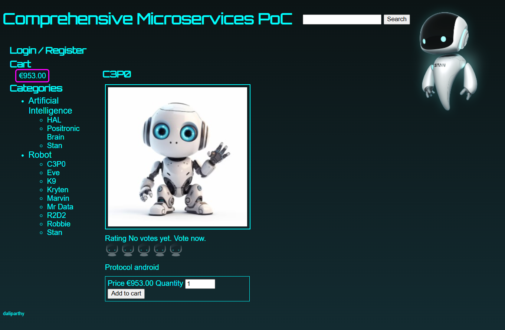
   

  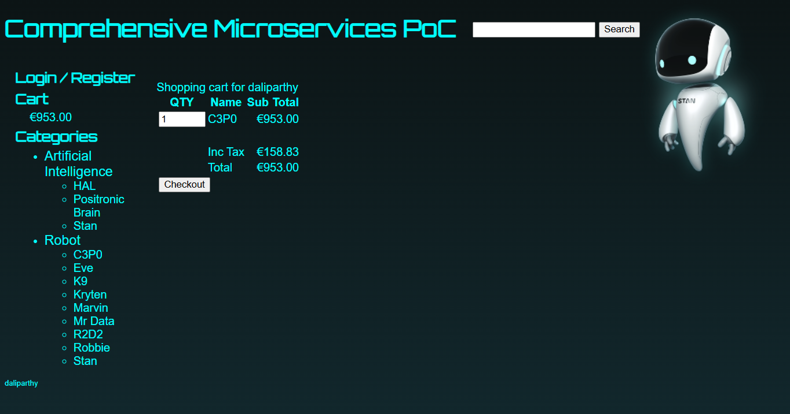
   

### 4. Shipping Information
During checkout, users can select their country and city, providing accurate shipping information

  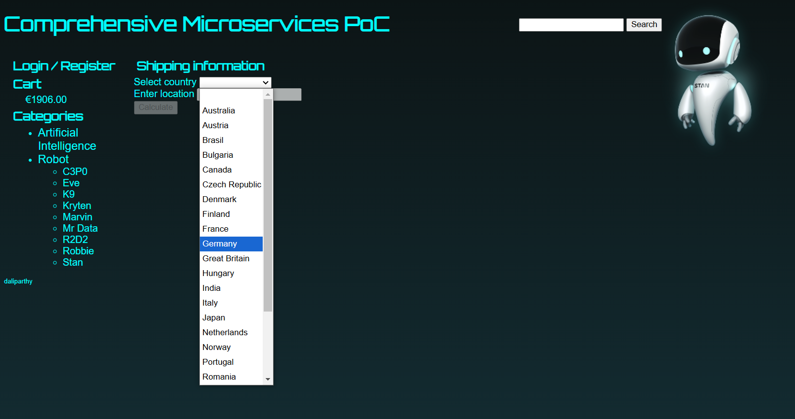
   

### 5. Shipping Cost Calculation
After inputting location details and confirm, users receive shipping cost estimates based on distance.

  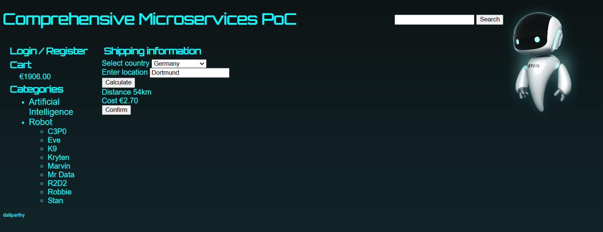
   

  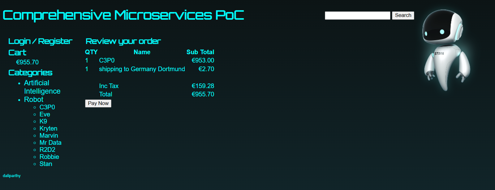
   

### 6. Order Confirmation
Upon selecting "Pay Now," the order is placed, and a confirmation ID is displayed.

  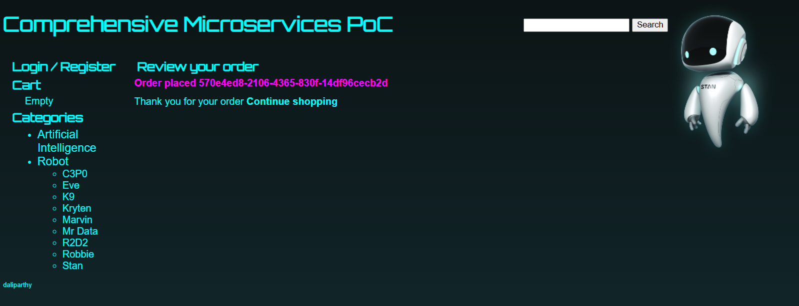
   

### 7. Logging back 
By clicking on Login back, it should show the order history.

  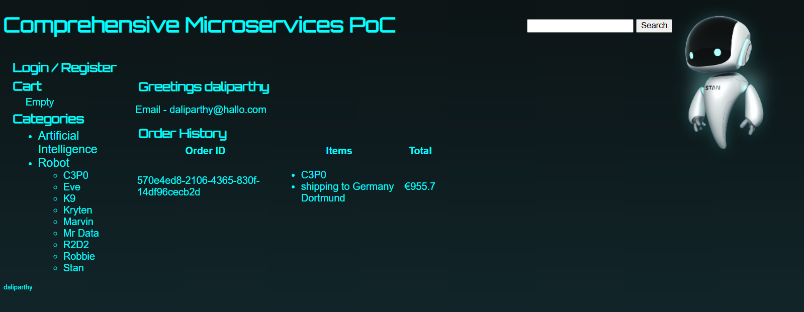
   

